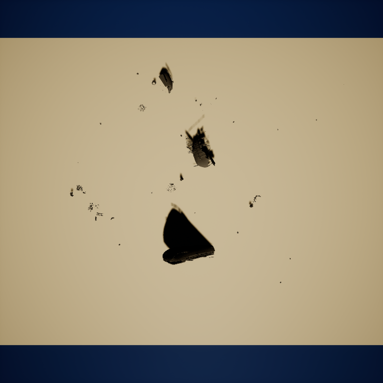
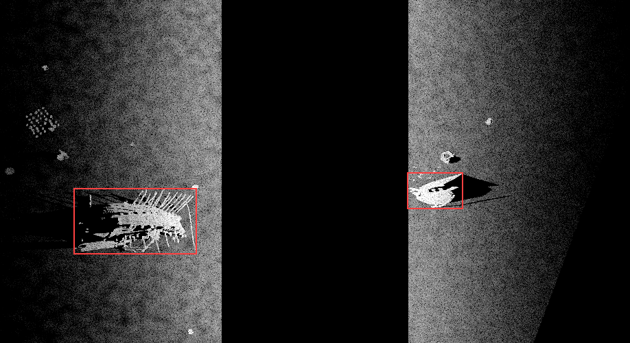

# Shipwrecks Sim

Shipwrecks Sim is a local dataset generator for side-scan sonar imagery. It runs on HoloOcean, generates a simulated underwater scene, and saves sonar images together with optional pixel masks, bounding boxes, NumPy arrays, previews, and session archives.

## Example output

The included example uses seed `20260911`, five 100 m survey legs, and 2,500 sonar pings. The complete example and its reproducibility files are in [`examples/sample_dataset`](examples/sample_dataset).

| Scene preview | Side-scan sonar with bounding boxes |
|---|---|
|  |  |


The dark center band is the nadir region beneath the vehicle. The two sides are port and starboard seabed returns. Red rectangles are object bounding boxes; white pixels are object masks.

## Base software and project changes

- Upstream simulator: [BYU HoloOcean](https://github.com/byu-holoocean/HoloOcean)
- Pinned source: HoloOcean `2.4.0`, `develop` commit [`136b87c1`](https://github.com/byu-holoocean/HoloOcean/commit/136b87c1beabef00308d5be7ec7ebe1a80ef0117)
- Engine: Unreal Engine `5.3.2`

The project adds a ray-based port/starboard side-scan sonar, acoustic signal processing, runtime terrain and object placement, object labels, seed-based scene and survey generation, geometry-aware acquisition settings, a local web UI, selective output saving, and dataset-session ZIP export.

All HoloOcean source modifications are contained in `patches/shipwrecks-sim-holoocean-2.4.0.patch`. A modified HoloOcean executable is not distributed; it is rebuilt locally from the pinned upstream source.

## Asset origin

The project assets were created from photographic reference material for shipwrecks and weathered or eroded objects associated with the western and southern seas of Korea. The reference imagery was converted into 3D assets with Meshy 6 and then prepared for simulation use. Asset metadata, dimensions, and source records are listed in `data/objects/asset_database.csv`.

## Requirements

| Item | Requirement or recommendation |
|---|---|
| Operating system | 64-bit Linux |
| Python | 3.10 |
| GPU | NVIDIA GPU; 8 GB VRAM or more recommended |
| Memory | 16 GB or more recommended |
| Storage | At least 40 GB free for source, build output, and assets |
| Tools | Git, Docker, NVIDIA Container Toolkit, curl, unzip |

Building the Unreal project requires access to the Unreal Engine container image. Link your Epic Games and GitHub accounts following [Epic's GitHub access guide](https://www.unrealengine.com/en-US/ue-on-github), then sign in to the container registry.

## Installation

```bash
docker login ghcr.io

git clone https://github.com/JungtaeKim02/shipwrecks-sim.git
cd shipwrecks-sim
./setup_simulator.sh
```

The setup script clones the pinned HoloOcean `develop` commit, applies the project patch, downloads the Release asset archive, imports the meshes and terrain configuration, builds TestWorlds, installs the world locally, and creates the Python environment. The Unreal build can take several minutes or longer.

To reuse an already downloaded asset archive:

```bash
SHIPWRECKS_ASSET_ARCHIVE=/path/to/holoocean-sss-assets-v0.2.0.zip ./setup_simulator.sh
```

The GitHub Release contains the asset archive and its SHA-256 checksum. It does not contain a simulator executable.

## Launch the web UI

```bash
source .venv/bin/activate
python webui/server.py
```

Open <http://127.0.0.1:8765> in a browser.

## Web UI guide

Use the UI in this order for a normal acquisition.

1. In **Sensor Parameters**, set the fixed sonar settings such as frequency, bandwidth, beam width, range resolution, and signal-processing options.
2. In **Environment**, set the water and sea-state settings used during acquisition.
3. In **Field (Terrain)**, choose a terrain. Use **Create Terrain** only when a new procedural terrain variant is needed.
4. In **Objects**, select asset categories or open **Asset Library** to inspect individual meshes, enable or exclude them, and apply the selection.
5. In **Survey Plan / Scene Generation**, choose the platform, seed, number of legs, and route settings, then click **Generate Scene**. Use **Use My Sensor Values** when the manually selected sensor values should be kept for that scene.
6. Use **Scene Visualization** to inspect the result. The **3D** and **Top View** buttons switch views; **Fit View** frames the scene; **Show Sensor Beam** displays the calculated coverage. Objects can be selected and adjusted in the 3D view.
7. Click **Save Settings** in the header before a run. **Capture Preview** saves a quick scene preview. **Stop** requests a safe stop for an active acquisition and keeps already completed samples.

### Dataset Acquisition panel

Use this panel for normal dataset production rather than one-off manual collection.

- **Acquisition Guide** explains which settings are fixed by the user, randomized for each scene, or calculated automatically from terrain geometry.
- **Dataset Name**, **Scene Count**, and **Start Seed** define the session identity and reproducible scene sequence.
- Object-density, wreck-tilt, receiver-noise, speckle, and seabed-texture controls define the allowed scene variation.
- **Outputs to Save** selects the files written for every scene: waterfall PNG, true-aspect PNG, raw NumPy, processed dB NumPy, pixel mask, YOLO bounding box, bounding-box review image, scene preview, and optional session ZIP.
- **Generate Plan Only** creates the planned scenes and time estimate without running the simulator.
- **Start Dataset Acquisition** runs the planned session.

The **Run** panel shows progress, logs, previews, and generated images. **Previous Acquisitions** lists earlier sessions. Waterfall PNG output uses one fixed display dynamic range; alternate display-range augmentations are not generated.

## Output layout

```text
data/datasets/<session>/
├── index.json
├── plan.csv
├── manifests/scenes.jsonl
└── samples/scene_000000/
    ├── preview.png
    ├── sss/waterfall/
    ├── sss/raw/
    ├── sss/processed/
    └── annotations/
        ├── masks/
        ├── bboxes/
        └── bbox_overlays/
```

Completed samples remain available if a run is stopped. Selecting ZIP export creates one archive for the completed dataset session.

## Reproduce the included example

```bash
python scripts/large_dataset.py \
  --spec examples/sample_dataset/dataset_spec.json \
  --dataset-root data/datasets/example_reproduced
```

The same seed recreates the planned scene and configuration. Exact floating-point values can differ across GPU and driver versions.

## Distribution layout

- Git repository: web UI, acquisition pipeline, HoloOcean source patch, build automation, terrain configuration, and example dataset
- GitHub Release: 3D asset archive and SHA-256 checksum
- Upstream HoloOcean and Unreal Engine: obtained and built locally by each user

HoloOcean and Unreal Engine remain subject to their respective upstream licenses.
